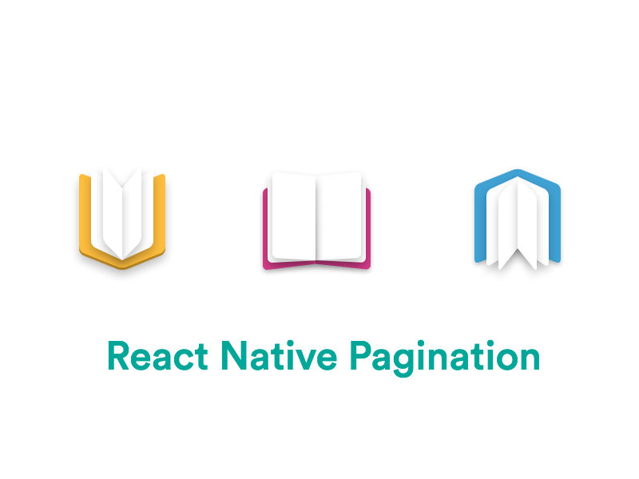

<p align="center">
  

</p>
  
<p align="center">
  The best Pagination component for React Native.
</p>

<p align="center">
  <a href="http://standardjs.com/"></a>
  <a href="https://npmjs.org/package/react-native-pagination"></a>
  <a href="https://npmjs.org/package/react-native-pagination"></a>
  <a href="https://github.com/garrettmac/react-native-pagination/pulls?q=is%3Apr+is%3Aclosed"></a>
  <a href="https://github.com/garrettmac/react-native-pagination/issues?q=is%3Aissue+is%3Aclosed"></a>
  <a href="https://gitter.im/garrettmac/react-native-pagination?utm_source=badge&utm_medium=badge&utm_campaign=pr-badge&utm_content=badge"></a>
</p>

# react-native-pagination


## Show Cases

> Try these cases by yourself very easy, Just open `examples/ios/pagination.xcodeproj` in Xcode, then press `Cmd + R`; you may edit `examples/index.ios.js` for switch cases.

### [examples/FlatListHorizontalExample.js](https://github.com/garrettmac/react-native-pagination/blob/master/examples/components/Basic)


## Getting Started

- [Installation](#installation)
- [Basic Usage](#basic-usage)
- [Properties](#properties)
  + [Basic](#basic)
  + [Custom basic style & content](#custom-basic-style--content)
  + [Pagination](#pagination)
  + [Control buttons](#control-buttons)
  + [Props of Children](#props-of-children)
  + [Basic props of `<ScrollView />`](#basic-props-of-scrollview-)
  + [Supported ScrollResponder](#supported-scrollresponder)
- [Examples](#examples)
- [Development](#development)

### Installation

```bash
$ npm i react-native-pagination --save
```

### Basic Usage

- Install `react-native` first

```bash
$ npm i react-native -g
```

- Initialization of a react-native project

```bash
$ react-native init myproject
```

- Then, edit `myproject/index.ios.js`, like this:

```jsx

```

### Properties

#### Basic


### Props of Children

#### Basic

| Prop  | Default  | Type | Description |
| :------------ |:---------------:| :---------------:| :-----|

#### Styles

| Prop  | Default  | Type | Description |
| :------------ |:---------------:| :---------------:| :-----|


```jsx

```


### Methods

### Examples

```bash
$ cd examples
$ npm i
$ react-native run-ios
```

> Quick start with [examples](https://github.com/garrettmac/react-native-pagination/tree/master/examples/).

### Development

```bash
$ cd examples
$ npm i
$ npm run dev
$ react-native run-ios
```

Then launch simulator to preview. Note that you just need to edit the source file `src/index.js`, the change will auto sync to examples.

And now that this project follows the [standard](https://github.com/feross/standard) code style, you'd better prepare it for IDE.

## Contribution

- [@garrettmac](mailto:garrett@vyga.io) Just me. The main author.

 **Help Wanted**

## Questions

Feel free to [contact me](mailto:garrett@vyga.io) follow my twitter @vygaio or [create an issue](https://github.com/garrettmac/react-native-pagination/issues/new)
